# Research: GitHub data-fetch pipeline — end-to-end trace, test coverage, blast radius

**Date**: 2026-07-31
**Researcher**: Tomasz Sierpinski
**Git Commit**: `74b9900bee6836897589f0a4e0b02106f079df5e`
**Branch**: `project-map`
**Repository**: `gos-tomek/gitgud`

## Research question

Analyse the process of fetching data from GitHub, with particular attention to the areas defined in `context/map/repo-map.md`. Three parallel sub-agents were tasked with:

1. **Trace e2e**: reconstruct the path from entry point through layers to write/read and back, with `file:line` step sequence and a Mermaid diagram.
2. **Test gaps**: which methods and branches on this path are covered, which are not.
3. **Blast radius**: what must change together when this pipeline changes — interface seam, generated layers, model, migrations, tests. Combine the static graph with git co-change history.

Report must contain two explicit critical sections: **Feature overview** and **Technical debt**.

## Summary

The GitHub ingestion pipeline is a Cloudflare-Workflow-driven pull system (no webhooks) that runs daily at 03:00 UTC and on-demand from the board UI. It walks a strict phase chain — `dispatch → sync-repo → orchestrate → prdetails (× N chunks) + reviews (chained)` — followed by `classify`. Every architectural choice is dictated by one hard constraint the code encodes only in method bodies and commit messages: the **50-external-subrequest-per-Workflow-invocation cap** on Cloudflare's free plan.

The pipeline reaches from React islands (`SyncIndicator`, `ImpactView`) through 11 API routes, one Workflow class, three service files, one Octokit factory, three RPCs, five DB tables, and back into the UI via `impact-metrics.ts`. Hermetic tests cover the three pure services well (`syncPrBatch`, `syncReviewCommentsForRepo`, `listAndUpsertPrsForRepo`); everything in `worker.ts` and `github.ts` has **zero unit coverage** — the only line of defence on phase-chain wiring is a single happy-path E2E (`tests/e2e/sync-chain.spec.ts`) and one PAT-leak integration test.

The blast radius is bounded but silent. Neither `worker.ts` nor the two `sync*.ts` routes share `import` edges with the caller/callee they depend on — the contract is enforced only by `env.d.ts:13`'s `Workflow<import("./worker").ClassificationBatchParams>` and by string conventions (`board-<boardId>-<dateStamp>` instance IDs, hard-coded `fetch()` URLs, hand-copied `SupabaseClient` type aliases, column names shared across `github-sync.ts` and `impact-metrics.ts`). A change to the pipeline typically has to walk: schema → RPC (+ service-role grant) → pipeline write → downstream reader in `impact-metrics.ts` / `classification.ts`, in that order, with the expand/contract discipline mandated by `CLAUDE.md`.

---

## 1. Feature overview

### 1.1 What the pipeline does

Given a board with N `github_repos`, the pipeline pulls all pull requests, reviews, and review comments updated since `last_synced_at` (or the last 90 days for a first sync), writes them to Supabase, then hands the freshly-imported root review comments to Workers AI for classification. The result feeds the impact metrics UI (`/board/:id/impact/:login/…`) and threads UI. There is **no GitHub webhook path** — every write is a pull, either from the daily cron or from a user clicking sync in `SyncIndicator`.

### 1.2 Trigger surface — entry points

| #   | Caller                         | Trigger                                                                                      | Auth           | Handler `file:line`                                                                                  |
| --- | ------------------------------ | -------------------------------------------------------------------------------------------- | -------------- | ---------------------------------------------------------------------------------------------------- |
| 1   | Cloudflare Cron                | `0 3 * * *` (`wrangler.jsonc`)                                                               | Worker context | `src/worker.ts:500` `scheduled()` → `env.CLASSIFICATION_BATCH.create(…)` per board (`worker.ts:514`) |
| 2   | `SyncIndicator.triggerSync`    | `POST /api/github/sync`                                                                      | supervisor     | `src/pages/api/github/sync.ts:19` → dispatch at `sync.ts:62`                                         |
| 3   | UI poller                      | `GET /api/github/sync/status?boardId=&instanceId=`                                           | board member   | `src/pages/api/github/sync/status.ts:60` → `.status()` at `status.ts:73`                             |
| 4   | UI cancel                      | `DELETE /api/github/sync/status`                                                             | supervisor     | `status.ts:82` → `.terminate()` at `status.ts:97`                                                    |
| 5   | Board wizard                   | `POST /api/github/validate-pat`                                                              | cookie session | `src/pages/api/github/validate-pat.ts:18` → `octokit.rest.users.getAuthenticated()`                  |
| 6   | Board wizard                   | `POST /api/github/validate-repo`                                                             | cookie session | `src/pages/api/github/validate-repo.ts:21` → `octokit.rest.repos.get(…)`                             |
| 7   | Board wizard                   | `POST /api/github/repos`                                                                     | cookie session | `src/pages/api/github/repos.ts:19` → `octokit.paginate(repos.listForAuthenticatedUser)`              |
| 8   | Board wizard                   | `POST /api/github/collaborators`                                                             | cookie session | `src/pages/api/github/collaborators.ts:29` → `octokit.paginate(repos.listContributors)`              |
| 9   | Profile settings               | `POST /api/profile/pat`                                                                      | cookie session | `src/pages/api/profile/pat.ts:19` → `rpc("set_user_github_pat")` at `pat.ts:55` (pgcrypto encrypt)   |
| 10  | Impact UI (5 fetches per view) | `GET /api/board/[boardId]/impact/[login]/{summary,author,reviewer,activity,classifications}` | board member   | `src/pages/api/board/[boardId]/impact/[login]/*.ts` → `src/lib/services/impact-metrics.ts`           |
| 11  | Threads UI                     | `GET /api/board/[boardId]/threads/[login]` and `.../threads/[threadId]`                      | board member   | `src/pages/api/board/[boardId]/threads/*.ts` → `impact-metrics.ts`                                   |

### 1.3 End-to-end sequence (ingestion)

1. **Trigger.** Cron builds `boardIds` from `github_repos.board_id` (`worker.ts:503`) and creates one Workflow per board with dedup key `board-<id>-<YYYY-MM-DD>` (`worker.ts:514`). Manual path is identical — `sync.ts:58-62` uses the same key, so a same-day manual click is a no-op unless the earlier run terminated (retry adds `-${Date.now()}` at `sync.ts:73`).
2. **Phase `dispatch`.** `runDispatch` (`worker.ts:116`) opens a service-role Supabase client (`src/lib/supabase-admin.ts:6`, bypasses RLS), reads repos via `listBoardRepos` (`github-sync.ts:230`), then spawns one `sync-repo` child per repo (`worker.ts:135`) with `since = repo.last_synced_at ?? now − 90 d` (`DEFAULT_BACKFILL_WINDOW_MS` at `worker.ts:46`). Child id: `repo-<repoId>-<msTimestamp>`.
3. **Phase `sync-repo`.** `runSyncRepo` (`worker.ts:160`) decrypts the PAT via `getGitHubToken` (`github.ts:132`) which calls `rpc("get_user_github_pat", { p_board_id, p_encryption_key })` — SQL uses `pgp_sym_decrypt` (`supabase/migrations/20260625120000_user_pat_and_expiry.sql:61`). Then `makeOctokit(token, env.GITHUB_API_BASE_URL)` (`github.ts:63`) installs `@octokit/plugin-retry` + `@octokit/plugin-throttling` and a `hook.after` that throws `GitHubRateLimitError` on `x-ratelimit-remaining === 0` (`github.ts:106`).
4. **List + upsert PRs.** One durable step "list-and-upsert-prs" (`worker.ts:174`) → `listAndUpsertPrsForRepo` (`github-sync.ts:268`) → `listPrsForRepo` (`:239`) paginates `pulls.list` `sort=updated,direction=desc` and short-circuits when a page's oldest PR predates `since` (`:246`). `dedupeById` (`:80`) handles the overlapping-update case; `upsertPullRequests` writes to `github_pull_requests` with `onConflict: "id"` (`:101`). Returns minimal `PrRef[]` (`{id, number}`) — full `PrItem[]` was breaching the 32 MiB Workflow-RPC serialization limit (comment at `:257-260`).
5. **Empty-repo short-circuit.** If `prs.length === 0`, `runSyncRepo` writes `github_repos.last_synced_at` (`worker.ts:183`) and spawns `classify` (`worker.ts:191`), then returns.
6. **Spawn `orchestrate`.** Otherwise `worker.ts:200-215` creates one `orchestrate-<repoId>-<syncStamp>` child. Split from `sync-repo` because listing alone can burn 20+ subs and `Workflow.create()` also counts (`worker.ts:157-159`).
7. **Phase `orchestrate`.** `runOrchestrate` (`worker.ts:223`) re-reads `PrRef[]` from `github_pull_requests` in 1000-row pages (`worker.ts:234-248`) — passing them via Workflow payload was the 32 MiB failure documented at `github-sync.ts:257-260`. Chunks into `GQL_PRS_PER_QUERY = 100` (`github-sync.ts:15`) and spawns one `prdetails` per chunk (`worker.ts:256-277`) plus one `reviews-<repoId>-0-<stamp>` (`worker.ts:279-295`). Fire-and-forget — no polling (`worker.ts:218-222`).
8. **Phase `prdetails` (per chunk).** `runPrDetails` (`worker.ts:300`) re-decrypts the PAT, builds a fresh Octokit, then in step `sync-pr-details` (`worker.ts:312`) calls `syncPrBatch` (`github-sync.ts:410`). `buildBatchPrDetailsQuery` (`github-sync.ts:308`) assembles one GraphQL query aliasing `pr_0 … pr_N` for `pullRequest(number:){ additions deletions changedFiles reviews(first:100){ nodes … pageInfo … } }`. `fetchBatchGqlWithSplitting` (`:342`) recursively bisects on splittable errors (`:389-403`, `MIN_SPLIT_SIZE = 1`, wall-clock deadline `BATCH_DEADLINE_MS = 180_000`).
9. **GraphQL review overflow.** PRs with >100 reviews drain via `buildBatchReviewPageQuery` (`github-sync.ts:318`), batching cursors of the same depth into one request. Capped at `MAX_OVERFLOW_ROUNDS = 2` (`:20`, enforced `:494`) so the per-chunk sub count stays inside the "1 decrypt + 1 GQL + ≤2 overflow + 1 RPC + 1 upsert ≈ 4–6 subs" envelope.
10. **DB writes per GQL batch.** Same loop iteration: `rpc("batch_update_pr_sizes", { updates })` writes size columns (`:583`), then `github_reviews.upsert(rows, { onConflict: "id" })` writes review rows (`:598`). Flush is per-batch, not per-PR (blew subrequest budget) and not deferred (`:426-431`).
11. **Phase `reviews`.** `runReviews` (`worker.ts:320`) re-decrypts PAT and calls `syncReviewCommentsForRepo` (`github-sync.ts:127`) with `sort=updated,direction=asc,since` — `asc` chosen so the last row's `updated_at` is a resumable cursor (`:141-143`). `maxPages = 25` per instance (`worker.ts:343`); when truncated, `nextSince` returns and a chained `reviews-<repoId>-<idx+1>-<stamp>` starts (`worker.ts:353-372`) — chaining rather than looping to give each page-batch a fresh 50-sub budget. `mapPrNumbersToIds` (`:105`) resolves comment `pull_request_url` numbers to PR ids via 1000-row pages (`:110-119`). Rows whose `review_id` FK is missing are skipped, not upserted, and logged (`:210-215`); accepted rows land in `github_review_comments` (`:218`).
12. **Finalize (last reviews page only).** When `nextSince` is null, `runReviews` writes `github_repos.last_synced_at = syncStartedAt` (`worker.ts:374-380`) then spawns `classify-<boardId>-<stamp>` — wrapped in try/catch that **only logs** (`worker.ts:391-394`), so a failed classify spawn does not fail the sync.
13. **Phase `classify` / `classify-chunk`.** `runClassify` (`worker.ts:403`) pages `rpc("get_unclassified_root_comments_for_board")`, chunks into `CLASSIFICATION_BATCH_SIZE = 20` (`worker.ts:44,432`), and spawns up to `CLASSIFY_MAX_SPAWNS_PER_DISPATCHER = 45` `classify-chunk` children per dispatcher (`worker.ts:45,433-445`), recursing itself with the remainder (`worker.ts:446-455`). `runClassifyChunk` (`worker.ts:464`) calls `classifyThreads` with the Workers-AI binding (`env.AI` or `AI_MOCK`, `worker.ts:476-477`), then upserts into `thread_classifications` (`worker.ts:484-486`).

### 1.4 Read path

- Astro `/board/[id]/impact/[githubLogin]/[...dateRange]` mounts `ImpactView` (`src/pages/board/[id]/impact/…astro:6`), which fires five parallel `fetch`es (`ImpactView.tsx:199-207`).
- Each API route auths via cookie SSR client, gates via `getBoardWithRole` (`boards.ts`), and delegates to `impact-metrics.ts` (`getImpactSummary:130`, `getAuthorMetrics:284`, `getReviewerMetrics:404`, `getActivityData:630`, `getClassificationAggregates:897`).
- `getBoardLastSyncedAt` (`impact-metrics.ts:106`) intentionally reports the **oldest** repo's `last_synced_at` (null if any repo never synced) — comment at `:100-105` explains why `fetched_at` was rejected as the freshness signal.
- After `POST /api/github/sync` returns `{ instanceId, status }`, `SyncIndicator.pollUntilDone` (`SyncIndicator.tsx:41`) polls status every 2 s until terminal; on complete, `ImpactView.handleSyncComplete` (`ImpactView.tsx:254-261`) bumps `fetchKey` and re-fetches all five sections.

### 1.5 Mermaid diagram

```mermaid
flowchart TB
    subgraph UI["UI (React islands)"]
      SI["SyncIndicator.tsx<br/>triggerSync / pollUntilDone"]
      IV["ImpactView.tsx<br/>useEffect fetch x5"]
    end

    subgraph Routes["src/pages/api"]
      SYNC["github/sync.ts POST<br/>ClassificationBatch.create"]
      STAT["github/sync/status.ts GET<br/>instance.status()"]
      LAST["board/[id]/last-synced.ts"]
      IMP["board/[id]/impact/[login]/*.ts"]
      VPAT["github/validate-pat.ts"]
      VREPO["github/validate-repo.ts"]
      REPOS["github/repos.ts"]
      COLL["github/collaborators.ts"]
      PPAT["profile/pat.ts"]
    end

    subgraph Cron["Cloudflare"]
      CRON["cron 0 3 * * *<br/>worker.ts scheduled()"]
    end

    subgraph WF["ClassificationBatchWorkflow (src/worker.ts)"]
      D["dispatch<br/>runDispatch:116"]
      SR["sync-repo<br/>runSyncRepo:160"]
      OR["orchestrate<br/>runOrchestrate:223"]
      PD["prdetails (per chunk)<br/>runPrDetails:300"]
      RV["reviews (chained)<br/>runReviews:320"]
      CL["classify / classify-chunk<br/>runClassify:403 / :464"]
    end

    subgraph Svc["src/lib/services/github-sync.ts"]
      LBR["listBoardRepos:230"]
      LUP["listAndUpsertPrsForRepo:268"]
      SPB["syncPrBatch:410<br/>fetchBatchGqlWithSplitting:342"]
      SRC["syncReviewCommentsForRepo:127"]
    end

    subgraph GH["src/lib/github.ts"]
      GTK["getGitHubToken:132"]
      MO["makeOctokit:63<br/>+retry +throttling"]
    end

    subgraph DB["Supabase"]
      T1[(github_repos)]
      T2[(github_pull_requests)]
      T3[(github_reviews)]
      T4[(github_review_comments)]
      T5[(user_profiles<br/>github_pat_encrypted)]
      T6[(thread_classifications)]
      RPC1{{"rpc get_user_github_pat<br/>pgp_sym_decrypt"}}
      RPC2{{"rpc batch_update_pr_sizes"}}
      RPC3{{"rpc get_unclassified_root_<br/>comments_for_board"}}
      RPC4{{"rpc set_user_github_pat<br/>pgp_sym_encrypt"}}
    end

    GHAPI[("GitHub REST + GraphQL")]

    SI -- "POST" --> SYNC
    SI -- "GET poll" --> STAT
    IV -- "GET x5" --> IMP
    IV -- "GET" --> LAST

    SYNC -- "CLASSIFICATION_BATCH.create" --> D
    STAT -- ".get().status()" --> D
    CRON -- "create per board" --> D

    D -- "step: list-board-repos" --> LBR --> T1
    D -- "spawn child" --> SR
    SR -- "getGitHubToken" --> GTK --> RPC1 --> T5
    SR -- "makeOctokit" --> MO
    SR -- "step: list-and-upsert-prs" --> LUP
    LUP -- "REST pulls.list (paginate)" --> GHAPI
    LUP -- "upsert" --> T2
    SR -- "spawn" --> OR
    OR -- "read PR refs" --> T2
    OR -- "spawn prdetails per chunk" --> PD
    OR -- "spawn reviews page 0" --> RV
    PD -- "getGitHubToken" --> GTK
    PD -- "step: sync-pr-details" --> SPB
    SPB -- "GraphQL BatchPrDetails" --> GHAPI
    SPB -- "rpc" --> RPC2 --> T2
    SPB -- "upsert" --> T3
    RV -- "getGitHubToken" --> GTK
    RV -- "step: sync-review-comments" --> SRC
    SRC -- "REST listReviewCommentsForRepo" --> GHAPI
    SRC -- "read PR num→id map" --> T2
    SRC -- "FK lookup" --> T3
    SRC -- "upsert" --> T4
    RV -- "update last_synced_at" --> T1
    RV -- "spawn classify" --> CL
    CL -- "rpc" --> RPC3
    CL -- "AI + upsert" --> T6

    VPAT -- "users.getAuthenticated" --> GHAPI
    VREPO -- "repos.get" --> GHAPI
    REPOS -- "repos.listForAuthenticatedUser" --> GHAPI
    COLL -- "repos.listContributors" --> GHAPI
    PPAT -- "users.getAuthenticated" --> GHAPI
    PPAT -- "rpc" --> RPC4 --> T5

    IMP -- "impact-metrics.ts" --> T1
    IMP --> T2
    IMP --> T3
    IMP --> T4
    LAST -- "getBoardLastSyncedAt" --> T1
```

### 1.6 Notable design invariants

- **50 external subrequests per Workflow invocation (free plan)** is the single design axis. Every phase split exists to fit it: `sync-repo` separated from `dispatch` because `Workflow.create()` itself is a sub (`worker.ts:157-159`); `orchestrate` fires prdetails+reviews children instead of polling them (`worker.ts:218-222`); `syncPrBatch` flushes per GQL batch, not per PR and not deferred (`github-sync.ts:426-431`); `syncReviewCommentsForRepo` chains at 25 pages so the _next_ Workflow starts with a fresh 50 (`worker.ts:343`, `github-sync.ts:134-137`).
- **Workflow-level retries are disabled** on `sync-pr-details` (`worker.ts:313`), `sync-review-comments` (`:347`), and `classify-batch` (`:479`). In-function retry (`withRetry`, `github-sync.ts:49`) does two `1 s / 3 s` retries only on `502 / ETIMEDOUT` (`isRetryableGqlError` at `:39`). The "poison PR" case is handled by recursive bisection in `fetchBatchGqlWithSplitting` (`:389-403`), not retry.
- **"Too many subrequests" is a re-throw sentinel.** Verified: 5 sites in `github-sync.ts` explicitly re-throw on this string (`:56, 377, 520, 590, 605`) so the step _fails_ and the next Workflow spawn gets a fresh budget. Note: `classification.ts:388` handles the same string with `break;` (not re-throw) — different escape pattern in that path.
- **DB writes are per-batch, not transactional.** Both `rpc("batch_update_pr_sizes")` and `github_reviews.upsert` commit independently (`github-sync.ts:583, 598`); a partial iteration is possible.
- **Cursor semantics differ by resource.** PR listing is `sort=updated,direction=desc` with client-side `since` and `dedupeById` for the mid-fetch update collision (`github-sync.ts:80, 242-250`); review-comment paging is `direction=asc` so `updated_at` is a resumable cursor (`:141-143`), tolerating a one-row overlap. `github_repos.last_synced_at` is written **only** after the last reviews page (`worker.ts:374-380`), so a mid-run failure re-does the whole window rather than skipping data.
- **PAT encryption boundary is at the DB.** Plaintext never persists: `set_user_github_pat` uses `pgp_sym_encrypt` inside `SECURITY DEFINER` (`20260625120000_user_pat_and_expiry.sql:31`); `get_user_github_pat` decrypts with the key passed from the Worker (`.sql:61`); the key comes from `astro:env/server GITHUB_TOKEN_ENCRYPTION_KEY` (`github.ts:5, 137`). Service-role callers bypass the ownership check (`.sql:49`) because the classification Workflow has no `auth.uid()`.
- **Two GitHub-token error classes, two rules.** `GitHubRateLimitError` (`github.ts:106`) propagates up and fails the step — never caught anywhere in `src/`. `GitHubAuthError` (`github.ts:120-125`) is caught only by validation routes, not by the Workflow — an expired PAT during a scheduled sync errors silently (visible only in Sentry/console).
- **No caller-provided `AbortSignal` is plumbed.** Verified: zero `AbortSignal`/`signal:` usage anywhere in `worker.ts`, `github-sync.ts`, or `github.ts` — the only mention is a code comment. Two abort layers exist, both outside caller control: (1) Octokit's **built-in 60 s `AbortSignal` timeout** on each request — comment at `github-sync.ts:47` explicitly documents this ("AbortSignal timeouts (60s) are NOT retried — they indicate a 'poison PR'"); (2) the **180 s wall-clock `BATCH_DEADLINE_MS`** inside `fetchBatchGqlWithSplitting` (`github-sync.ts:353-358`), which short-circuits _further_ GQL calls but does not cancel in-flight requests.
- **Instance-ID convention encodes an authorization boundary.** `sync/status.ts:53` uses `` `!instanceId.startsWith(`board-${boardId}-`)` `` to reject cross-board probes. The convention lives in `worker.ts:514`, `sync.ts:59`, and (implicitly) all child-instance IDs.
- **No webhook path.** All ingestion is pull-based (cron + user click). No `/api/github/webhook` route, no `github_installations` table.

---

## 2. Test coverage — what's tested, what isn't

### 2.1 Coverage summary by module

| Module                                                                                                                                              | Direct unit/hermetic                                                                                                                                                                                     | Incidental (E2E / integration only)                                                                                                                                                    | Uncovered                                                                                                                                                                                                                                                                                                                                                                        |
| --------------------------------------------------------------------------------------------------------------------------------------------------- | -------------------------------------------------------------------------------------------------------------------------------------------------------------------------------------------------------- | -------------------------------------------------------------------------------------------------------------------------------------------------------------------------------------- | -------------------------------------------------------------------------------------------------------------------------------------------------------------------------------------------------------------------------------------------------------------------------------------------------------------------------------------------------------------------------------- |
| `src/lib/github.ts` — `parseGitHubTokenExpiry`                                                                                                      | ✅ full (5 cases, `tests/unit/github.test.ts:22-44`)                                                                                                                                                     | —                                                                                                                                                                                      | —                                                                                                                                                                                                                                                                                                                                                                                |
| `src/lib/github.ts` — `makeOctokit` Octokit hooks (retry, throttle, rate-limit throw, auth-error map)                                               | ❌ none                                                                                                                                                                                                  | —                                                                                                                                                                                      | all four hook branches (`github.ts:71-92, 104-107, 120-125`)                                                                                                                                                                                                                                                                                                                     |
| `src/lib/github.ts` — `getGitHubToken`                                                                                                              | ❌ none                                                                                                                                                                                                  | happy-path exercised in `tests/integration/pat-leak.test.ts:166`                                                                                                                       | missing key (`:138`), rpc error (`:147`), null token (`:151`)                                                                                                                                                                                                                                                                                                                    |
| `src/lib/github.ts` — `createGitHubClient`                                                                                                          | —                                                                                                                                                                                                        | —                                                                                                                                                                                      | **dead export** (grep finds 0 call sites in `src/` or `tests/`)                                                                                                                                                                                                                                                                                                                  |
| `src/lib/services/github-sync.ts` — `syncPrBatch`                                                                                                   | ✅ 5 cases (multi-batch happy, overflow + cap, GQL error → errors[], `"Too many subrequests"` re-throw at GQL layer, empty input, subrequest-budget worst-case) — `tests/hermetic/sync-pr-batch.test.ts` | —                                                                                                                                                                                      | recursive bisection path (`:388-404`), wall-clock deadline (`:353-359`), `!prData` missing-alias (`:463-468`), DB-side re-throw at `:590/:605`, `submittedAt === null` filter (`:558`)                                                                                                                                                                                           |
| `src/lib/services/github-sync.ts` — `syncReviewCommentsForRepo`                                                                                     | ✅ 7 cases (happy, pagination, `maxPages` truncation + `nextSince`, unmapped-PR filter, empty, dedupe overlap, subrequest budget) — `tests/hermetic/sync-review-comments.test.ts`                        | —                                                                                                                                                                                      | `review_id` FK filter drop (`:200-215`), `IN_CHUNK=500` boundary, review-lookup error throw                                                                                                                                                                                                                                                                                      |
| `src/lib/services/github-sync.ts` — `listAndUpsertPrsForRepo`                                                                                       | ✅ 3 cases (happy, `maxPrsPerRepo` cap, subrequest budget @ 2500 PRs) — `tests/hermetic/list-and-upsert-prs.test.ts`                                                                                     | —                                                                                                                                                                                      | `since` early-stop `done()` branch (`listPrsForRepo:244-250`), `mapPrNumbersToIds` multi-page loop                                                                                                                                                                                                                                                                               |
| `src/worker.ts` — Workflow phases (`runDispatch`, `runSyncRepo`, `runOrchestrate`, `runPrDetails`, `runReviews`, `runClassify`, `runClassifyChunk`) | ❌ **none**                                                                                                                                                                                              | happy path via `tests/e2e/sync-chain.spec.ts:37` (asserts non-zero KPIs), error re-wrap via `tests/integration/pat-leak.test.ts:166` polling for `'Step "list-and-upsert-prs" failed'` | required-field guards; empty-PR shortcut (`worker.ts:180-198`); `read-pr-refs` multi-page (`:235-248`); `runReviews` chain-continuation with `nextSince` (`:353-372`); `runClassify` recursive-dispatcher (`:446-455`); `runClassify` `PAGE_SIZE=1000` pagination (`:412-427`); `scheduled` handler entirely (`:500-521`) — the daily cron path that actually runs in production |
| `src/pages/api/github/sync.ts`                                                                                                                      | —                                                                                                                                                                                                        | 401 / 403 / 404 / happy PAT-non-leak — `tests/integration/pat-leak.test.ts:190/201/212/134`                                                                                            | 503, invalid JSON, Zod, duplicate-id running/errored/retry (`sync.ts:66-78`), Workflow.create-followup 500                                                                                                                                                                                                                                                                       |
| `src/pages/api/github/sync/status.ts`                                                                                                               | —                                                                                                                                                                                                        | `DELETE` used in `afterAll` cleanup (no assertion)                                                                                                                                     | **cross-board probe rejection at `:53` — zero coverage on a security gate**; validate branches; `GET` happy + 404; `DELETE` non-owner                                                                                                                                                                                                                                            |
| `src/pages/api/github/validate-pat.ts` — expiry capture                                                                                             | ✅ 3 header cases (`tests/hermetic/validate-pat.test.ts:42/55/68`)                                                                                                                                       | —                                                                                                                                                                                      | 503, 401, Zod, `github_pat_` prefix warning, real `GitHubAuthError → 401` mapping                                                                                                                                                                                                                                                                                                |

### 2.2 Highest-risk uncovered branches (ordered)

1. **`src/pages/api/github/sync/status.ts:53`** — `` `instanceId.startsWith(`board-${boardId}-`)` `` is a security gate with zero coverage; a regression would let any board member probe/terminate another board's Workflow instance.
2. **`src/pages/api/github/sync.ts:66-78`** — "instance already exists" branch (status lookup + retry-with-suffix on errored/complete). A bug here would either double-run syncs (data corruption via concurrent upserts) or block manual re-syncs after a failure.
3. **`src/lib/github.ts:120-125`** — real `hook.error` 401/403 → `GitHubAuthError` mapping. Every hermetic caller stubs a fake `GitHubAuthError`, so the actual mapper is never invoked.
4. **`src/lib/github.ts:104-107`** — `GitHubRateLimitError` throw on `x-ratelimit-remaining=0`. If this stops throwing, the entire pipeline continues past exhaustion, quietly getting empty data.
5. **`src/lib/services/github-sync.ts:583-609`** — `syncPrBatch` DB error paths. Only the GQL-side "Too many subrequests" re-throw is tested; the symmetric DB-side re-throws at `:590` and `:605` are uncovered.
6. **`src/lib/services/github-sync.ts:463-468`** — `!prData` (PR missing from GraphQL response). A GraphQL server returning a partial alias set would silently drop those PRs' size stats and reviews without appearing in `errors[]`.
7. **`src/lib/services/github-sync.ts:388-404`** — `fetchBatchGqlWithSplitting` recursive halving on splittable errors. The whole "aborted/timeout → split in half" recovery path is un-exercised.
8. **`src/lib/services/github-sync.ts:88-101`** — `upsertPullRequests` field mapping (`state: pr.merged_at ? "merged" : pr.state`, `is_draft ?? false`, `author_login ?? ""`, `author_github_id ?? 0`). None of the four defaulting/mapping expressions is asserted; a regression to the "merged" mapping would silently corrupt the `state` column that `impact-metrics.ts` reads.
9. **`src/lib/services/github-sync.ts:244,246`** — `listPrsForRepo` `since` filter + `done()` early-stop. The `list-and-upsert-prs.test.ts` fake explicitly no-ops the callback, so incremental syncs' cutoff logic is uncovered.
10. **`src/worker.ts:500-521`** — `scheduled` handler entirely uncovered (the daily cron path that actually runs in production).
11. **`src/worker.ts:353-372`** — `runReviews` chain-continuation when `nextSince` is set. Multi-page truncation → next-instance spawn is not exercised end-to-end.
12. **`src/worker.ts:446-455`** — `runClassify` recursive-dispatcher branch (>`CLASSIFY_MAX_SPAWNS_PER_DISPATCHER=45` chunks). Any classify run with >900 threads runs code with zero tests.
13. **`src/lib/github.ts:71-92`** — `throttle.onRateLimit` / `onSecondaryRateLimit` retry-count decision. If these return the wrong boolean, real GitHub throttling either loops forever or gives up on the first hit.

### 2.3 What tests DO exist (do not underclaim)

- **Function-level (unit + hermetic):** `parseGitHubTokenExpiry` (5), `syncPrBatch` (5), `syncReviewCommentsForRepo` (7), `listAndUpsertPrsForRepo` (3), `validate-pat` (3), PAT-fallback across 4 routes (12).
- **Integration:** `tests/integration/pat-leak.test.ts` — exercises `POST /api/github/sync` end-to-end with 401 / 403 / 404 / dispatch happy path, and guards that Workflow step return values never contain the plaintext PAT (`49e9b9d` regression fix).
- **E2E:** `tests/e2e/sync-chain.spec.ts` — one happy path, entire Workflow chain against real `workerd`, asserts non-zero impact-page KPIs. This is the only test that reaches `worker.ts` methods at all.
- **Explicitly deferred (per `context/foundation/test-plan.md §2, §3`):** R1 mid-chain failure recovery is deferred to Phases 6 and 7, both marked `not started`. So the missing hermetic per-phase failure tests in `worker.ts` are known-deferred, not incidental omissions.

### 2.4 Test-infrastructure constraints

- **No unit-level Workflow harness.** `worker.ts` methods are never called directly; the only vehicle that reaches them is the real Cloudflare `workerd` via `wrangler.e2e.jsonc`. Hermetic coverage stops at the pure services (`syncPrBatch`, `syncReviewCommentsForRepo`, `listAndUpsertPrsForRepo`) that are exported and take injected `supabase`/`octokit`.
- **Two mutually exclusive GitHub-mock patterns.** Hermetic tests `vi.mock("@/lib/github", …)` — the entire Octokit-plugin chain (retry, throttling, request/response/error hooks in `github.ts:63-130`) is unreachable. E2E uses `tests/e2e/github-mock-server.ts` on port 9999 handling three endpoints, and returns a single fixture regardless of `since`/`page`, so pagination and boundary conditions aren't exercised in E2E either.
- **Real-Supabase requirement.** `tests/integration/**` require `npx supabase start`. CI splits this into a dedicated `test-integration` job; the primary `validate` job explicitly excludes them.
- **PAT encryption fixtures.** `pat-leak.test.ts:20` reads real `GITHUB_TOKEN_ENCRYPTION_KEY`; the three hermetic files that touch PAT-decryption paths mock the virtual module `astro:env/server`.
- **Sentry / `scheduled` handler.** No test harness of any kind.

---

## 3. Blast radius — what must change together

### 3.1 Change-together graph (git co-change × static import graph)

**`src/worker.ts` (35 commits)**

| Co-changed file                                                       | # joint | Why                                                                                                        | Evidence                         |
| --------------------------------------------------------------------- | ------- | ---------------------------------------------------------------------------------------------------------- | -------------------------------- |
| `src/lib/services/github-sync.ts`                                     | 13      | Every subrequest-budget rewrite (`d22b80b`, `f62fdf6`, `9176f74`, `4b80ca4`, `ed37794`)                    | git + static (imports 6 symbols) |
| `src/lib/github.ts`                                                   | 3       | PAT-fetch extraction (`f62fdf6`), AbortSignal fix (`070e781`)                                              | git + static                     |
| `src/env.d.ts`                                                        | 3       | Declares `Workflow<import("./worker").ClassificationBatchParams>` at `:13`                                 | git + static                     |
| `wrangler.jsonc`                                                      | 2       | Workflow binding, cron, AI binding                                                                         | git + static (main entry)        |
| `src/lib/services/classification.ts`                                  | 2       | `classifyThreads(ai, supabase, threadChunk)` invoked by `runClassifyChunk`; owns `AiBinding` type          | git + static                     |
| `src/pages/api/github/sync.ts`                                        | 1       | `env.CLASSIFICATION_BATCH.create({ params: { boardId } })` — **string-only static coupling** (no `import`) | git + convention                 |
| `supabase/migrations/20260704200000_unclassified_rpc_filter_bots.sql` | 1       | RPC return shape → `TABLE(id bigint)`; `worker.ts:421` reads `row.id`                                      | git + implicit SQL               |

**`src/lib/services/github-sync.ts` (42 commits)**

| Co-changed file                                                         | # joint | Why                                                                                                                                     | Evidence                                               |
| ----------------------------------------------------------------------- | ------- | --------------------------------------------------------------------------------------------------------------------------------------- | ------------------------------------------------------ |
| `src/worker.ts`                                                         | 14      | See above                                                                                                                               | git + static                                           |
| `src/lib/github.ts`                                                     | 7       | Throttling plugin + retry moved in `2e32aa1`, changed which error strings `withRetry`/`isRetryableGqlError` see                         | git + static                                           |
| `src/types.ts`                                                          | 3       | Schema-evolution PRs added camelCase types alongside DB columns — **but `github-sync.ts` itself does not import from `@/types`** (§3.2) | git only                                               |
| `supabase/migrations/20260616120000_add_pr_size_and_thread_columns.sql` | 2       | Added columns written by `upsertPullRequests` + `syncReviewCommentsForRepo`                                                             | git + implicit SQL                                     |
| `supabase/migrations/20260629130000_batch_update_pr_sizes_rpc.sql`      | 2       | Defines RPC called at `github-sync.ts:583`                                                                                              | git + implicit SQL                                     |
| `src/lib/services/impact-metrics.ts`                                    | 2       | Reads every column the pipeline writes at 12 `.from("…")` chains + 5 RPC calls (verified ast-grep)                                      | git; **coupled only via shared DB schema**, no imports |
| `src/components/impact/SyncIndicator.tsx`                               | 2       | `fetch("/api/github/sync")` at `:62`, status URL at `:46` — URL strings only                                                            | git only                                               |
| `tests/component/CreateBoardForm.test.tsx`                              | 4       | **Coincidental** — multi-feature bootstrap commits; no runtime edge                                                                     | git only                                               |

**`src/lib/github.ts` (17 commits)**

| Co-changed file                                                                                                          | # joint | Why                                                               | Evidence                                 |
| ------------------------------------------------------------------------------------------------------------------------ | ------- | ----------------------------------------------------------------- | ---------------------------------------- |
| `src/lib/services/github-sync.ts`                                                                                        | 7       | See above                                                         | git + shared `type SupabaseClient` alias |
| `src/worker.ts`                                                                                                          | 4       | See above                                                         | git + static                             |
| `tests/integration/pat-leak.test.ts`                                                                                     | 3       | Direct tests of `getGitHubToken` + PAT redaction                  | git                                      |
| `src/env.d.ts`                                                                                                           | 3       | `GITHUB_TOKEN_ENCRYPTION_KEY`, `GITHUB_API_BASE_URL` bindings     | git + static                             |
| `src/pages/api/github/{validate-pat,validate-repo,repos,collaborators}.ts` + `.../profile/pat.ts` + `.../github/sync.ts` | 2 each  | Import `makeOctokit`, `GitHubAuthError`, `parseGitHubTokenExpiry` | git + static                             |

### 3.2 Interface seam

**Exports & callers (`github-sync.ts`)**

- `GQL_PRS_PER_QUERY: 100` — worker.ts:11
- `listBoardRepos(supabase, boardId): Promise<RepoRow[]>` — worker.ts:122
- `listAndUpsertPrsForRepo(supabase, octokit, repo, since?, maxPrsPerRepo?): Promise<PrRef[]>` — worker.ts:174 + hermetic test
- `syncPrBatch(supabase, octokit, owner, repoName, prs): Promise<{reviews, errors}>` — worker.ts:312 + hermetic test
- `syncReviewCommentsForRepo(supabase, octokit, repoId, owner, repoName, since?, maxPages?): Promise<{comments, nextSince?}>` — worker.ts:336 + hermetic test
- `interface PrRef { id; number }` — worker.ts:32,236,245
- `interface RepoRow` — tests only (worker.ts inlines the shape at :170)

**Exports & callers (`github.ts`)** — call-site counts verified with ast-grep (see §9)

- `makeOctokit(token, baseUrl?)` — 8 live call sites: `worker.ts:168, 308, 328` (×3) + `pages/api/github/{validate-repo:63, collaborators:71, validate-pat:51, repos:59}` + `pages/api/profile/pat.ts:48`. Additionally called inside the dead-export `createGitHubClient` at `github.ts:165`
- `getGitHubToken(supabase, boardId, encryptionKey?)` — only production callers at `worker.ts:167, 307, 327`. Additional call inside dead-export `createGitHubClient` at `github.ts:164`
- `createGitHubClient(...)` — **dead export** (verified: 0 call sites in `src/` or `tests/`; grep only finds definition at `github.ts:159` and a comment in `tests/integration/pat-leak.test.ts:186`)
- `parseGitHubTokenExpiry` — `validate-pat.ts:54`, `profile/pat.ts:51`, `tests/unit/github.test.ts`
- `GitHubAuthError` — caught in **4 of 6 `api/github/*` routes** (`validate-pat.ts:63`, `validate-repo.ts:73`, `repos.ts:80`, `collaborators.ts:107,117`) plus `api/profile/pat.ts:70`. **NOT caught in `api/github/sync.ts` or `api/github/sync/status.ts`** — the two Workflow-dispatch routes surface auth errors as generic 500s. Pattern: every route that calls `makeOctokit` directly catches it
- `GitHubRateLimitError` — **not caught anywhere in `src/`** (verified: only definition, name assignment, and single throw at `github.ts:106`). Any handler that hits a rate limit 500s
- `GitHubTokenMissingError` — **not caught anywhere in `src/`** (verified: only definition and 3 throws at `github.ts:139, 148, 153`)

**Exports & callers (`worker.ts`)**

- `class ClassificationBatchWorkflow` — bound by name in `wrangler.jsonc:workflows[0].class_name`
- `interface ClassificationBatchParams` — imported by `src/env.d.ts:13` via `import("./worker")`; contract shared implicitly with `sync.ts` and `sync/status.ts` via runtime `env.CLASSIFICATION_BATCH.create({ params })`
- default export = `Sentry.withSentry(...)` — Cloudflare `fetch` + `scheduled` entry

**`types.ts` shapes on this path.** None of `worker.ts`, `github-sync.ts`, `github.ts` imports from `@/types`. The pipeline builds its own snake_case row shapes matching DB columns then upserts to Supabase. `src/types.ts` publishes parallel camelCase shapes (`GitHubPullRequest`, `GitHubReview`, `GitHubReviewComment` at `types.ts:21-79`) that **no pipeline code enforces**. `impact-metrics.ts:21` imports from `@/types` but re-declares its own inline row types for what the pipeline writes. **Consequence:** adding a column to `github_pull_requests` in the pipeline does not trigger a type error in `impact-metrics.ts` — the two ends agree by convention (column name string), and the seam is silent.

**DB tables the pipeline writes**

- `github_repos` — writes `last_synced_at` (worker.ts:183, :376). Read by `impact-metrics.ts:95,108,638,998`, `boards.ts:97,141,156`.
- `github_pull_requests` — full row via `upsertPullRequests` (`github-sync.ts:101`); PR-ref re-read (`worker.ts:239`); size columns via RPC. Read by `impact-metrics.ts:119,294,1109`, `classification.ts:261`.
- `github_reviews` — upserted (`github-sync.ts:598`); read for FK gate (`:205`). No other reader in `src/`.
- `github_review_comments` — upserted (`github-sync.ts:218`). Read by `classification.ts:239,240`, `impact-metrics.ts:493,792,1136`.
- `thread_classifications` — upserted (`worker.ts:485`). Read by `impact-metrics.ts:1101`.

**RPCs on the seam**

- `get_user_github_pat(p_board_id, p_encryption_key)` — `github.ts:142`; defined in `20260625130000_create_board_read_user_pat.sql`, granted in `20260731090000_grant_get_user_github_pat_service_role.sql`.
- `batch_update_pr_sizes(updates jsonb)` — `github-sync.ts:583`; defined in `20260629130000_batch_update_pr_sizes_rpc.sql`, granted in `20260731092000_grant_batch_update_pr_sizes_service_role.sql`.
- `get_unclassified_root_comments_for_board(p_board_id)` — `worker.ts:418`; defined in `20260619090000_unclassified_threads_rpc.sql`, return shape changed in `20260704200000_unclassified_rpc_filter_bots.sql`, granted in `20260731091000_grant_unclassified_rpc_service_role.sql`.

**Wrangler bindings**

- `workflows[0]`: name `classification-batch`, binding `CLASSIFICATION_BATCH`, **class_name `ClassificationBatchWorkflow` — string reference to `worker.ts:95`**.
- `ai.binding: AI` — worker.ts:476.
- `triggers.crons: ["0 3 * * *"]` — daily 03:00 UTC.
- `main: ./src/worker.ts`.
- `wrangler.e2e.jsonc` overrides: `triggers.crons: []`, `GITHUB_API_BASE_URL=http://localhost:9999`, `AI_MOCK=true`.

**Secrets required at runtime.** `src/env.d.ts:10-22` and `astro.config.mjs env.schema` — **two different declarations of the same env vars, both must stay in sync**: `SUPABASE_URL`, `SUPABASE_KEY`, `SUPABASE_SERVICE_KEY`, `GITHUB_TOKEN_ENCRYPTION_KEY`, `SENTRY_DSN`, optional `GITHUB_API_BASE_URL`, optional `AI_MOCK`.

### 3.3 Must-change-together checklist

**Types & shapes**

- Adding/renaming a column the pipeline writes: update the corresponding write in `github-sync.ts` (`:87-100` for PRs, `:179-192` for comments, `:562-568` for reviews) **and** every reader in `impact-metrics.ts` (**11 `.from("…").select("…")` chains on pipeline-written tables + 5 RPC calls, verified ast-grep §9** — column strings inside those selects enumerate every field), `classification.ts:239-240,261`, `boards.ts:97,141,156`.
- The `types.ts` camelCase mirrors are decorative — no runtime enforces they match DB rows. They are currently not imported anywhere; verify before deleting.
- `ClassificationBatchParams` (`worker.ts:22-40`): every new field must be optional or every caller (`worker.ts` scheduled, `api/github/sync.ts`, `api/github/sync/status.ts`) must supply it.

**Generated / regenerated layers**

- **None.** No Supabase generated types (grep confirms). No Astro types beyond `npx astro sync` after `astro.config.mjs env.schema` edits.
- All coupling is by column-name convention.

**DB migrations (expand/contract per `CLAUDE.md`)**

- Additive column adds (`ADD COLUMN`): ship in one PR with the pipeline change (precedent: `20260616120000_add_pr_size_and_thread_columns.sql`).
- New RPC: creation is additive; **grant to `service_role`** before pipeline call (precedent: `batch_update_pr_sizes` required `20260731092000` follow-up).
- Column rename or type change: must lag one release behind the pipeline commit that stops writing/reading the old shape — `wrangler rollback` reverts the Worker only, not the schema.
- FK/constraint changes: `20260630140000_drop_review_id_fk.sql` is the canonical case; if you re-add the constraint, `github-sync.ts:210-215` filter must be updated in the same or prior release.
- RPC return-shape change (`20260704200000`) requires `DROP FUNCTION` first — plan for `worker.ts:412-427` to land in the same PR.

**Tests**

- Hermetic: `tests/hermetic/list-and-upsert-prs.test.ts`, `sync-pr-batch.test.ts`, `sync-review-comments.test.ts` — signature changes fail these first.
- Integration: `tests/integration/pat-leak.test.ts` — asserts PAT non-leak; any refactor of Workflow step return values must re-run it.
- Component: `tests/hermetic/{validate-pat,profile-pat,github-pat-fallback}.test.ts` mock `makeOctokit` + `GitHubAuthError` — changing those shapes breaks the mocks.
- E2E: `tests/e2e/sync-chain.spec.ts` + `tests/e2e/github-mock-server.ts` — fixture shape and `/api/github/sync`, `/api/github/sync/status` URLs are the contract; mock server's `pull_request_url`/`pull_request_review_id` is what `syncReviewCommentsForRepo` parses.
- **No test asserts `ClassificationBatchParams` shape** — an interface change lands silently until integration/E2E runs.

**Wrangler / infra config**

- `wrangler.jsonc`: `workflows[0].class_name`, `main`, `triggers.crons`, `ai.binding`. `wrangler.e2e.jsonc`: mirror any binding change; `GITHUB_API_BASE_URL` port 9999 hard-coded to `github-mock-server.ts`.
- `src/env.d.ts` and `astro.config.mjs env.schema` — dual declaration of `SUPABASE_*` and `GITHUB_TOKEN_ENCRYPTION_KEY`.
- `.github/workflows/{ci,deploy}.yml` — inject env vars into Astro build; a new required secret means editing both.
- Cloudflare account: KV `HOMEPAGE_CACHE`, Workflows binding, Workers AI enrolment — created out-of-band, referenced by ID.

**Docs / context**

- `CLAUDE.md` — architecture and migration policy.
- `context/map/repo-map.md §2, §4` — names `github-sync.ts` + `worker.ts` as hotspot #1 and notes "zero unit tests on `worker.ts`".
- `context/map/artifact-2-structure.md`, `context/map/artifact-4-changes-risk.md` — refresh when adding cross-layer imports.

### 3.4 Silent-coupling landmines

- **`import type` from `types.ts` invisible to `lint:deps`.** Pipeline files don't import from `@/types`, but downstream `impact-metrics.ts:21` does and consumes every pipeline-written column by name. A new `types.ts` field cascades to 19 files (repo-map §2); only `tsc --noEmit` (both src and `tests/tsconfig.json` passes) catches it.
- **Hand-copied `type SupabaseClient = NonNullable<ReturnType<typeof createClient>>;`** — 7 occurrences (`github.ts:10`, `github-sync.ts:22`, `boards.ts:10`, `classification.ts:6`, `impact-metrics.ts:23`, `token-status.ts:3`, `sync/status.ts:20`). Static graph shows one edge; real coupling is 7×.
- **`fetch()` URL strings referencing sync routes.** `SyncIndicator.tsx:46` (`/api/github/sync/status?…`) and `:62` (`/api/github/sync`). Neither dependency-cruiser nor TS sees these. PR #32 already broke this once (repo-map §4).
- **String-only binding + params contract between `pages/api/github/sync*.ts` and `worker.ts`.** `env.CLASSIFICATION_BATCH.create({ params: { boardId } })` sends a params object typed by `env.d.ts:13`. Adding an optional field the caller **needs** to send (e.g. a new dispatch mode) compiles clean and just skips that mode.
- **Instance-ID convention as authorization boundary.** `sync/status.ts:53` uses `` `!instanceId.startsWith(`board-${boardId}-`)` ``. Convention lives in `worker.ts:514`, `sync.ts:59`, and every child ID — if any producer diverges, status/terminate silently 403s. No test asserts the convention.
- **SQL constraints / triggers assuming column shape.**
  - `github_review_comments.review_id` FK dropped in `20260630140000`; `github-sync.ts:205-215` still filters against `github_reviews`. Re-adding the FK requires deleting that filter or the pipeline silently drops rows.
  - `batch_update_pr_sizes` interpolates `bigint`/`int` casts on the size columns; changing types requires editing the RPC body, not just the migration.
  - `get_unclassified_root_comments_for_board` hard-codes bot filters (`dependabot`, `renovate`, `codecov`, `codecov-bot`, `codecov-commenter`, `github-actions`, `%[bot]`, `%-bot`) — new bots require a migration.
- **Cloudflare runtime assumptions encoded only in comments/method bodies.**
  - 50-external-subrequest cap → phase split (`worker.ts:158-160, :218-222, :299-300, :401-402`); `MAX_OVERFLOW_ROUNDS = 2`; `CLASSIFY_MAX_SPAWNS_PER_DISPATCHER = 45`; per-batch flush pattern (`github-sync.ts:427-431`).
  - `step.sleep` does NOT reset the subrequest budget — commit `9176f74` message.
  - `Workflow.create({params})` requires a single interface, not a discriminated union (`worker.ts:19-20`).
  - 32 MiB Workflow-RPC serialization limit → `PrRef[]` instead of `PrItem[]` (`github-sync.ts:257-260`).
  - `retries: { limit: 0 }` on expensive steps because retries replay completed steps' subrequests. Enabling retries pushes past the 50-sub budget on first replay.
  - Cron dedup key was day-precision (caused silent double-sync failures) — replaced with ms-precision `syncStamp` for **child** IDs (`worker.ts:124-126`). Top-level `board-<id>-<dateStamp>` is still day-precision by design.
  - `GitHubRateLimitError` never caught in `src/` — a rate-limit hit propagates as 500 or step failure.

---

## 4. Technical debt

Concrete, current-state debt observed on the pipeline. No recommendations — just the surface a future change or incident-response has to walk.

### 4.1 Coverage debt (measurable)

- **Zero unit tests on `worker.ts`.** All seven phase methods (`runDispatch`, `runSyncRepo`, `runOrchestrate`, `runPrDetails`, `runReviews`, `runClassify`, `runClassifyChunk`) plus `scheduled` and `runStep` are exercised only through one happy-path E2E and one integration test that polls a log line. Per `context/foundation/test-plan.md §3`, phases 6 and 7 covering this are `not started` — deferred, not accidental.
- **`scheduled` handler (`worker.ts:500-521`) — the daily cron path that actually runs in production — has no test of any kind.**
- **Security-boundary code with zero coverage.**
  - `sync/status.ts:53` cross-board probe rejection.
  - `sync.ts:66-78` duplicate-id branch (allows/blocks re-triggering).
  - `github.ts:120-125` real `GitHubAuthError` 401/403 mapping (every hermetic test stubs a fake).
  - `github.ts:104-107` `GitHubRateLimitError` throw (silent-empty-data risk if it stops throwing).
- **Silent-drop branches.**
  - `syncPrBatch`'s `!prData` missing-alias branch (`github-sync.ts:463-468`) — a partial GraphQL response drops PRs without an entry in `errors[]`.
  - Recursive-halving path (`:388-404`) has no test — the "poison PR" recovery for aborted/timeout GQL errors would fail silently if broken.
- **DB-write error paths in `syncPrBatch` (`:583-609`).** Only the GQL-side `"Too many subrequests"` re-throw is asserted; the two symmetric DB-side re-throws at `:590` and `:605` are uncovered.
- **Field-mapping regressions have no tripwire.** `upsertPullRequests` (`:88-101`) mapping — `state: pr.merged_at ? "merged" : pr.state`, `is_draft ?? false`, `author_login ?? ""`, `author_github_id ?? 0` — is not asserted. A regression silently corrupts columns that `impact-metrics.ts` reads.
- **Incremental-sync cutoff (`:244, :246`) is untested.** The `list-and-upsert-prs.test.ts` fake no-ops the `done()` callback, so `since` filter behaviour is unexercised.
- **Multi-page paths untested.** `mapPrNumbersToIds` beyond one 1000-row page; `runOrchestrate` `read-pr-refs` beyond one page; `runReviews` chain-continuation with `nextSince`; `runClassify` recursive-dispatcher with >45 chunks.

### 4.2 Structural / architectural debt

- **Contract-by-string across the largest coupling in the app.** `pages/api/github/sync*.ts` ↔ `worker.ts` share **zero import edges**; the contract is a params interface reached through `env.d.ts:13`'s `Workflow<import("./worker").ClassificationBatchParams>` and a runtime dedup convention (`board-<boardId>-<dateStamp>`). No test asserts the convention. This is the third silent-coupling channel the repo-map §3 called out (`fetch()` URL strings + `import type` + this one).
- **Column-name coupling without a type bridge.** `github-sync.ts` writes DB rows; `impact-metrics.ts`, `classification.ts`, `boards.ts` read them. Neither side imports from `@/types` for these row shapes — everyone re-declares inline `type` aliases matching the DB. Adding/renaming a column is invisible to `tsc --noEmit`.
- **Seven hand-copied `type SupabaseClient = …` aliases.** Static graph shows one dependency; real coupling is 7×.
- **Dual declaration of env vars.** `src/env.d.ts` (Cloudflare Worker types) and `astro.config.mjs env.schema` (astro:env runtime) both declare `SUPABASE_*` / `GITHUB_TOKEN_ENCRYPTION_KEY`. Nothing enforces they stay in sync.
- **Wrangler class-name string reference.** `wrangler.jsonc:workflows[0].class_name` is a string tied to `worker.ts:95`. Renaming the class silently breaks the deployment binding.
- **Dead export not garbage-collected.** `createGitHubClient` in `src/lib/github.ts:159-166` has zero call sites in `src/` or `tests/`.

### 4.3 Error-handling debt

- **`GitHubRateLimitError` is a thrown-only class** — verified: zero catch sites in `src/`. The pipeline surfaces it up and the enclosing Workflow step fails with no user-visible or Sentry-classified signal beyond a step failure. Validation routes (which do catch `GitHubAuthError`) do not catch this class either, so a rate-limit hit returns a generic 500.
- **`GitHubAuthError` catch surface is asymmetric.** Caught in the 4 validation routes (`validate-pat`, `validate-repo`, `repos`, `collaborators`) and `api/profile/pat.ts`, but **NOT** in `api/github/sync.ts` or `api/github/sync/status.ts`, and **NOT** anywhere in the Workflow. Precisely: every route that calls `makeOctokit` directly catches it; the Workflow-dispatch routes and the Workflow itself don't. Consequence: during a scheduled sync, an expired PAT errors the step silently (visible only in Sentry/console) — no user-facing signal that "your PAT expired and today's sync did not happen".
- **`GitHubTokenMissingError` also never caught anywhere** — verified: only definition + 3 throws at `github.ts:139, 148, 153`, no catches.
- **Errors that "spawn classify" swallow.** `runReviews:391-394` wraps the classify spawn in try/catch that only logs — a failed classify spawn silently drops that board out of classification for the day, and the sync itself reports success.
- **No `AbortSignal` plumbing.** In-flight Octokit calls cannot be cancelled from outside; only the internal 180 s wall-clock deadline stops _further_ GQL calls, and in-flight requests continue.
- **Non-transactional per-batch writes.** `rpc("batch_update_pr_sizes")` and `github_reviews.upsert` commit independently inside the same `syncPrBatch` iteration; a partial iteration (sizes written, reviews failed) is possible and undetectable from row state.

### 4.4 Undocumented Cloudflare runtime knowledge

Every one of these constraints exists only in method bodies and commit messages — a change author has to reconstruct them by reading the git log:

- 50-external-subrequest cap → drives every phase split.
- `step.sleep` does NOT reset the subrequest budget (`9176f74`).
- `Workflow.create({params})` requires a single interface, not a discriminated union (`worker.ts:19-20`).
- 32 MiB Workflow-RPC serialization limit → `PrRef[]` return shape (`github-sync.ts:257-260`).
- Retries replay completed steps' subrequests → `retries: { limit: 0 }` on expensive steps.
- Cron dedup key precision (day for top-level, ms for children) — the precedent bug that forced the split is only in commit history.
- PR #67/#68 revert cluster — the reasoning behind "disable Workflows retries" lives only in `revert: undo PR #67 + disable Workflows retries (#68)`.

### 4.5 Schema / migration debt

- **Bot-name filter hard-coded in SQL** (`20260704200000`) — adding/removing a bot requires a migration, not a config.
- **`github_review_comments.review_id` FK dropped, `github_reviews` filter still runs** (`github-sync.ts:205-215`) — if the FK is ever re-added, the filter must be removed or valid rows are silently skipped.
- **`batch_update_pr_sizes` bakes column types into the RPC body** — a column type change means a migration to the table _and_ to the RPC.
- **Two service-role grants land in three separate migrations dated `20260731090000/091000/092000`** — the pattern is "add RPC, then remember to grant service-role in a follow-up".

### 4.6 Observability / user-signal debt

- **`getBoardLastSyncedAt` reports the oldest repo's timestamp, null if any repo never synced.** UI "last synced" therefore has surprising semantics — comment at `impact-metrics.ts:100-105` documents the deliberate choice; users may not know that "never" for one repo hides fresh data on others.
- **No end-user signal when the daily cron sync fails.** All failures surface only in Sentry/logs; the impact page shows stale KPIs with no banner.
- **PR-list pagination has no stable cursor.** `dedupeById` exists because `sort=updated desc` lets a PR updated mid-fetch appear on two pages; if the dedupe were ever removed, Postgres raises `ON CONFLICT DO UPDATE command cannot affect row a second time` on a single multi-row upsert.
- **No retry visibility.** `withRetry` (`github-sync.ts:49`) logs on retry but has no metrics; there is no way to detect elevated retry rates before they turn into visible failures.

---

## 5. Code references

- `src/worker.ts:95, :116, :160, :223, :300, :320, :403, :464, :500` — Workflow class + phase handlers + scheduled entry
- `src/worker.ts:22-40` — `ClassificationBatchParams` (the string-contract interface)
- `src/worker.ts:157-159, :218-222, :299-300, :401-402` — subrequest-budget design comments
- `src/lib/services/github-sync.ts:15, :20, :338, :340` — pipeline constants (`GQL_PRS_PER_QUERY`, `MAX_OVERFLOW_ROUNDS`, `MIN_SPLIT_SIZE`, `BATCH_DEADLINE_MS`)
- `src/lib/services/github-sync.ts:49, :80, :101, :127, :218, :239, :268, :308, :318, :342, :410, :583, :598` — main service functions
- `src/lib/services/github-sync.ts:56, :377, :520, :590, :605` — "Too many subrequests" re-throw sentinels
- `src/lib/services/github-sync.ts:257-260, :426-431` — Cloudflare-constraint comments in code
- `src/lib/github.ts:5, :63, :106, :120-125, :132, :159-166` — env import, Octokit factory, hooks, `getGitHubToken`, dead `createGitHubClient`
- `src/pages/api/github/sync.ts:19, :58-78` — dispatch route + duplicate-id branch
- `src/pages/api/github/sync/status.ts:29, :53, :60, :82, :97` — status route + cross-board authz gate
- `src/pages/api/github/{validate-pat,validate-repo,repos,collaborators}.ts` + `src/pages/api/profile/pat.ts` — one-off Octokit callers
- `src/components/impact/SyncIndicator.tsx:41, :46, :62` — poll loop + hard-coded URLs
- `src/components/impact/ImpactView.tsx:199-207, :254-261` — five-fetch effect + re-fetch after sync
- `src/lib/services/impact-metrics.ts:100-105` — comment explaining `last_synced_at` choice
- `src/env.d.ts:10-22` — env bindings incl. `CLASSIFICATION_BATCH` Workflow generic
- `astro.config.mjs` — `env.schema` (parallel to `env.d.ts`)
- `wrangler.jsonc`, `wrangler.e2e.jsonc` — workflow / cron / AI / KV bindings
- Migrations: `supabase/migrations/20260616120000_add_pr_size_and_thread_columns.sql`, `20260619090000_unclassified_threads_rpc.sql`, `20260625120000_user_pat_and_expiry.sql`, `20260625130000_create_board_read_user_pat.sql`, `20260629130000_batch_update_pr_sizes_rpc.sql`, `20260630140000_drop_review_id_fk.sql`, `20260704200000_unclassified_rpc_filter_bots.sql`, `20260731090000_grant_get_user_github_pat_service_role.sql`, `20260731091000_grant_unclassified_rpc_service_role.sql`, `20260731092000_grant_batch_update_pr_sizes_service_role.sql`
- Tests: `tests/hermetic/{list-and-upsert-prs,sync-pr-batch,sync-review-comments,validate-pat,profile-pat,github-pat-fallback}.test.ts`, `tests/unit/github.test.ts`, `tests/integration/pat-leak.test.ts`, `tests/e2e/{sync-chain.spec.ts,github-mock-server.ts}`

## 6. Architecture insights

- **Phase chain is fire-and-forget by design.** Cloudflare Workflow parents do not poll children; each child is a separate 50-sub budget. Chain visibility is entirely reconstructed from row state (`github_repos.last_synced_at`, `thread_classifications` rows), not from a run-log table.
- **Cursor sematics differ by resource — deliberately.** PR list is desc + client-side `since` filter (fits the "recently updated" bias of the endpoint); review-comments list is asc + `updated_at` cursor (paginates deterministically for long histories). Two different patterns, one pipeline.
- **Service functions are DI-friendly, Workflow phases are not.** The three services take `(supabase, octokit, …)` and are trivial to hermetic-test; the Workflow phases receive a `WorkflowStep` and `env` shape that only `workerd` provides. Hence the coverage cliff at the `worker.ts` boundary.
- **PAT lives at three trust levels.** Plaintext in Worker RAM (during Octokit calls), pgcrypto-encrypted at rest in `user_profiles`, decrypted per-Workflow-step via service-role RPC. Never persisted plaintext; never sent to the client.
- **Read side is thick, write side is thin.** `impact-metrics.ts` (1150 lines, 12 `.from` chains + 5 RPC calls — see §9) is far larger than `github-sync.ts` (620 lines) — the pipeline stores what GitHub gives, all business logic (velocity, throughput, classifications aggregation) is at read time.

## 7. Historical context (from prior changes and commits)

- **Sync-pipeline rewrites cluster.** `d22b80b`, `f62fdf6`, `9176f74`, `4b80ca4`, `ed37794` — sequence of subrequest-budget refactors that produced the current phase split. `f62fdf6` extracted `getGitHubToken` from an earlier `createGitHubClient`; the old function survives as a dead export.
- **PR #67/#68 revert cluster.** `revert: undo PR #67 + disable Workflows retries (#68)` and `fix(worker): reset subrequest budget with step.sleep between phases (#53, #54)` — the reasoning behind the two hardest Cloudflare constraints lives only in commit messages.
- **`49e9b9d`** — added `tests/integration/pat-leak.test.ts` after a regression where a Workflow step returned an object containing the decrypted PAT (Cloudflare Workflow step outputs are persisted in the run log). Any refactor of Workflow step return values needs to re-run this test.
- **Grant migrations dated `20260731090000/091000/092000`** — three RPCs each needed a separate service-role grant migration because the initial RPC creations forgot them.
- **`repo-map.md` and its four artifacts** (project-map branch) — synthesised the risk profile that this research grounds in: `github-sync.ts`+`worker.ts` is hotspot #1, `types.ts` is highest-blast-radius (invisible to `lint:deps`), `boards.ts` is highest fan-in service, `fetch()` URL strings and hand-copied types are the un-tooled couplings.

## 8. Related research

- `context/map/repo-map.md` — synthesis document that flagged this pipeline as hotspot #1 and named the un-tooled coupling channels this report grounds in specific `file:line`s.
- `context/map/artifact-1-territory.md` — git activity (co-change data used in §3.1).
- `context/map/artifact-2-structure.md` — dependency-cruiser static graph.
- `context/map/artifact-4-changes-risk.md` — risk sensitivity classification.
- `context/foundation/test-plan.md §2-§3, §6.1` — testing strategy (deferred phases 6/7 cover the R1 mid-chain-failure gaps §2.3 cites).

## 9. Verification of structural claims (ast-grep + grep)

Structural claims from the initial synthesis (call-site counts, "only here", "always through X", repeated call shapes) were verified against the live codebase at commit `74b9900`. Full data below; corrections have been folded into the sections above.

| #   | Claim                                                                                                       | Verdict                          | Evidence                                                                                                                                                                                                                                                                                                                                                                                                                                                                                                                                                                                                   |
| --- | ----------------------------------------------------------------------------------------------------------- | -------------------------------- | ---------------------------------------------------------------------------------------------------------------------------------------------------------------------------------------------------------------------------------------------------------------------------------------------------------------------------------------------------------------------------------------------------------------------------------------------------------------------------------------------------------------------------------------------------------------------------------------------------------- |
| 1   | 7 hand-copied `type SupabaseClient = NonNullable<ReturnType<typeof createClient>>` aliases at 7 named files | ✅ **Confirmed**                 | ast-grep pattern `type SupabaseClient = $$$` returns exactly the 7 files: `src/lib/github.ts:10`, `token-status.ts:3`, `services/classification.ts:6`, `services/boards.ts:10`, `services/github-sync.ts:22`, `services/impact-metrics.ts:23`, `pages/api/github/sync/status.ts:20`                                                                                                                                                                                                                                                                                                                        |
| 2   | `"Too many subrequests"` re-throws at 5 sites in `github-sync.ts:56, 377, 520, 590, 605`                    | ✅ **Confirmed** (with addendum) | grep confirms all 5 lines. Additionally `src/lib/services/classification.ts:388` handles the same message with `break;` (not `throw`) — a different pattern in an adjacent codepath                                                                                                                                                                                                                                                                                                                                                                                                                        |
| 3   | `makeOctokit(...)` callers: worker.ts ×3 + 5 API routes                                                     | ⚠️ **Refined**                   | 8 live sites (3 in worker.ts, 5 in API routes) + 1 additional call inside dead-export `createGitHubClient` at `github.ts:165`. Report §3.2 updated to enumerate all 9                                                                                                                                                                                                                                                                                                                                                                                                                                      |
| 4   | `getGitHubToken` — only production callers at `worker.ts:167, 307, 327`                                     | ✅ **Confirmed** (with note)     | ast-grep finds those 3 plus `github.ts:164` — the extra site is inside the dead-export `createGitHubClient`, so "only production caller" holds                                                                                                                                                                                                                                                                                                                                                                                                                                                             |
| 5   | `createGitHubClient` is a dead export — 0 call sites in `src/` or `tests/`                                  | ✅ **Confirmed**                 | ast-grep call-pattern returns zero matches; grep finds it only at the definition (`github.ts:159`) and in a comment in `tests/integration/pat-leak.test.ts:186`                                                                                                                                                                                                                                                                                                                                                                                                                                            |
| 6   | `GitHubRateLimitError` not caught anywhere in `src/`                                                        | ✅ **Confirmed**                 | grep returns only 3 references: class definition (`:19`), name assignment (`:23`), throw (`:106`). Zero `catch`/`instanceof` sites                                                                                                                                                                                                                                                                                                                                                                                                                                                                         |
| 7   | `GitHubTokenMissingError` not caught anywhere in `src/`                                                     | ✅ **Confirmed**                 | grep returns 5 references: definition (`:12`), name (`:15`), throws at `:139, 148, 153`. Zero catches                                                                                                                                                                                                                                                                                                                                                                                                                                                                                                      |
| 8   | `GitHubAuthError` caught in "all `api/github/*` + `api/profile/pat.ts`"                                     | ❌ **Refuted**                   | Caught in only **4 of 6** `api/github/*` routes: `validate-pat.ts:63`, `validate-repo.ts:73`, `repos.ts:80`, `collaborators.ts:107, 117`, plus `api/profile/pat.ts:70`. **NOT caught** in `api/github/sync.ts` or `api/github/sync/status.ts`. Precisely: caught in every route that calls `makeOctokit` directly; the two Workflow-dispatch routes don't. Report §3.2, §4.3 corrected                                                                                                                                                                                                                     |
| 9   | Pipeline files (`worker.ts`, `github-sync.ts`, `github.ts`) don't import from `@/types`                     | ✅ **Confirmed**                 | `grep 'from "@/types"'` on those three files returns zero hits                                                                                                                                                                                                                                                                                                                                                                                                                                                                                                                                             |
| 10  | `impact-metrics.ts:21` imports from `@/types`                                                               | ✅ **Confirmed**                 | Multi-line import statement ends at `:21` with `} from "@/types";`. 21 total files across `src/` import from `@/types`                                                                                                                                                                                                                                                                                                                                                                                                                                                                                     |
| 11  | `impact-metrics.ts` reads pipeline-written data at "30+ call sites"                                         | ❌ **Refuted (inflated ~2.5×)**  | Actual: **12 `.from("…")` chains total**, of which **11 hit pipeline-written tables** (`github_repos: 4` at `:95,108,638,998`; `github_pull_requests: 3` at `:119,294,1109`; `github_review_comments: 3` at `:493,792,1136`; `thread_classifications: 1` at `:1101`), plus **5 RPC calls** (`get_board_reviews_for_reviewer` at `:156, 423, 666`; `get_board_root_comments_for_commenter` at `:163, 673`). Total ≈ 16 read sites, not 30+. Each `.select("…")` string still enumerates many columns, so the _column_ touch-count is high, but the _call-site_ count is not. Report §3.1 and §3.3 corrected |
| 12  | `env.CLASSIFICATION_BATCH.create(...)` "from worker.ts + sync.ts"                                           | ⚠️ **Refined (understated)**     | worker.ts has **10 create sites** (`:135, 191, 202, 260, 281, 357, 386, 440, 449, 514`); `sync.ts` has **2** (`:62, 74`); `.get()` sites at `sync.ts:67`, `status.ts:73, 96`. Total 12 create + 3 get. The file-granularity claim holds, but the density inside `worker.ts` is worth calling out because it's the surface every phase-chain edit walks                                                                                                                                                                                                                                                     |
| 13  | No `AbortSignal` plumbed through the pipeline                                                               | ⚠️ **Refined**                   | Zero actual `AbortSignal`/`signal:` usage in the three pipeline files. However, comment at `github-sync.ts:47` explicitly documents Octokit's built-in **60 s `AbortSignal` timeout** on each request ("AbortSignal timeouts (60s) are NOT retried — they indicate a 'poison PR'"). Report §1.6 updated to distinguish caller-provided (none) vs Octokit-internal (60 s) vs wall-clock (180 s `BATCH_DEADLINE_MS`)                                                                                                                                                                                         |
| 14  | No `/api/github/webhook` route, no `github_installations` table                                             | ✅ **Confirmed**                 | `find src/pages/api -iname "*webhook*"` → 0 files. `grep -r github_installations src/ supabase/` → 0 hits                                                                                                                                                                                                                                                                                                                                                                                                                                                                                                  |
| 15  | Hardcoded sync URLs at `SyncIndicator.tsx:46` and `:62`                                                     | ✅ **Confirmed**                 | `:46` uses `` `/api/github/sync/status?boardId=${boardId}&instanceId=${instanceId}` ``; `:62` uses `"/api/github/sync"`. No other file in `src/` references these two URLs                                                                                                                                                                                                                                                                                                                                                                                                                                 |
| 16  | Instance-ID `board-` prefix at `worker.ts:514`, `sync.ts:59`, `status.ts:53`                                | ✅ **Confirmed**                 | All three lines match exactly the pattern claimed. Child-instance prefixes (`repo-`, `orchestrate-`, `prdetails-`, `reviews-`, `classify-`) exist as separate conventions inside worker.ts                                                                                                                                                                                                                                                                                                                                                                                                                 |
| 17  | `ClassificationBatchParams` imported by `env.d.ts:13`                                                       | ✅ **Confirmed**                 | Exact line: `CLASSIFICATION_BATCH: Workflow<import("./worker").ClassificationBatchParams>;`                                                                                                                                                                                                                                                                                                                                                                                                                                                                                                                |
| 18  | DB read-site line references in `impact-metrics.ts`, `classification.ts`, `boards.ts`                       | ✅ **Confirmed**                 | ast-grep matches every cited line exactly. Addendum: `github_reviews` truly has "no other reader in `src/`" — only `github-sync.ts:205` (FK lookup) + `:598` (upsert)                                                                                                                                                                                                                                                                                                                                                                                                                                      |
| 19  | Cited from repo-map: "25 `fetch()` URL strings across 11 components"                                        | ⚠️ **Different data window**     | Current state: **12 files** in `src/components + src/pages` contain `fetch(`. `/api/github/*` fetches specifically: **7 URLs across 5 files** (`CreateBoardForm.tsx:58,106,127,251`, `ContributorManager.tsx:69`, `RepoManager.tsx:100`, `SyncIndicator.tsx:62`). Repo-map's snapshot is either slightly older or counts more URL patterns (`/api/board/*`, etc.)                                                                                                                                                                                                                                          |
| 20  | `ClassificationBatchWorkflow` class-name string binding in `wrangler.jsonc`                                 | ✅ **Confirmed**                 | `wrangler.jsonc:29` and `wrangler.e2e.jsonc:29` both contain `"class_name": "ClassificationBatchWorkflow"`, matching `src/worker.ts:95`                                                                                                                                                                                                                                                                                                                                                                                                                                                                    |

**Summary:** 12 confirmed, 4 refined, 2 refuted-and-corrected (claims 8 and 11), 2 refined-with-context (claims 13 and 19). The two refuted claims were live errors: an incorrect universal quantifier ("all `api/github/*` catch `GitHubAuthError`") and an inflated call-site count ("30+ reads in `impact-metrics.ts`"). Corrections are folded into §3.1, §3.2, §3.3, §4.3, and §1.6.

**Ast-grep patterns used** (for reproducibility):

- `ast-grep -p 'type SupabaseClient = $$$' --lang typescript src/`
- `ast-grep -p 'makeOctokit($$$)' --lang typescript src/`
- `ast-grep -p 'getGitHubToken($$$)' --lang typescript src/`
- `ast-grep -p 'createGitHubClient($$$)' --lang typescript src/ tests/`
- `ast-grep -p '$_.select($$$)' --lang typescript src/lib/services/impact-metrics.ts`
- `ast-grep -p '$_.CLASSIFICATION_BATCH.create($$$)' --lang typescript src/`
- `ast-grep -p '$_.from("github_repos")' --lang typescript src/` (and per-table)

String/text claims (error strings, imports, hardcoded URLs) were verified with `grep -rn`.

## 10. Open questions

- **What is the intended user-facing signal when the daily cron sync fails or when the PAT expires?** Currently silent to the user; only Sentry/logs see it.
- **Is `types.ts`'s camelCase mirror of `GitHubPullRequest`/`GitHubReview`/`GitHubReviewComment` still intended for future use?** Not imported anywhere; if the answer is "no", removing them shrinks a false coupling surface.
- **What is the plan for `createGitHubClient`?** Dead export in `src/lib/github.ts:159-166`; leaving it inflates the public API surface.
- **Should the instance-ID convention (`board-<boardId>-…`) be lifted into a shared helper?** Currently duplicated in `worker.ts:514`, `sync.ts:59`, and `sync/status.ts:53` with no test asserting they agree.
- **Is a partial-iteration recovery path in `syncPrBatch` desired?** Current behaviour: sizes may be written while reviews fail (or vice versa), with no compensating action.
- **Multi-repo boards at scale.** `runOrchestrate` and `mapPrNumbersToIds` both page at 1000; no test exercises repos with >1000 PRs. Whether real usage hits this is unknown.
- **Is a webhook path on the roadmap?** All ingestion is currently pull-based; a webhook path would restructure most of `worker.ts`.
