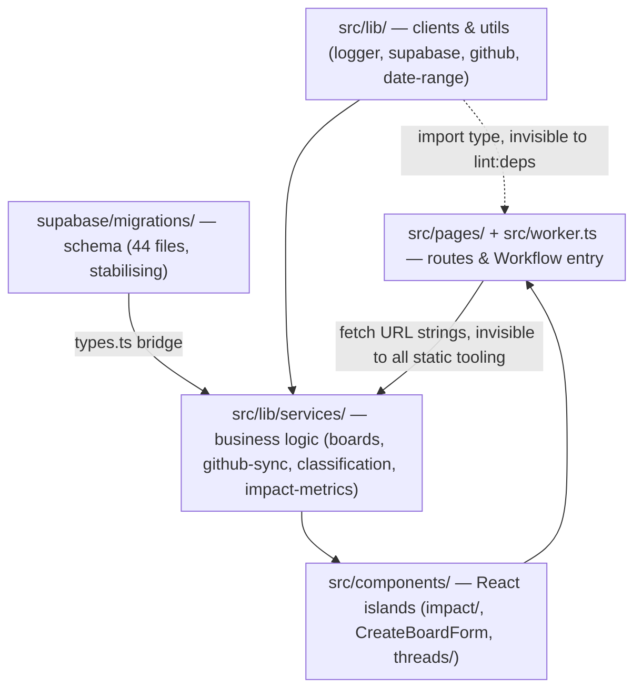

# Repo Map — Onboarding Synthesis

> Synthesized from `artifact-1-territory.md` (git activity), `artifact-2-structure.md` (static import graph, dependency-cruiser), `artifact-3-contributors.md` (authorship), `artifact-4-changes-risk.md` (risk classification).
> Data window: 2026-05-21 – 2026-07-28 (252–254 commits, ~2 months). See §7 for what this does and does not cover.

## 1. TL;DR

GitGud is a solo-built Astro 6 SSR app (React 19 islands, Supabase, Cloudflare Workers/Workflows) that ingests GitHub PR/review activity and turns it into board-scoped contribution metrics and AI-assisted classification. The system has four real layers — DB schema, service logic, UI components, route entry points — connected as a clean layered DAG (zero cycles) for everything the static graph can see, plus at least three coupling channels the graph is blind to (`import type`, DI-injected Supabase client, hardcoded `fetch()` URLs — see §3). Work concentrated in two phases: a fast bootstrap (May–Jun, schema-heavy) that has since stabilised (Jul, sync-refactor-heavy). The pain is concentrated in one place: the GitHub sync pipeline (`github-sync.ts` + `worker.ts`), which absorbed 67 changes including a full revert, encodes undocumented Cloudflare Workflow constraints, and has zero unit tests on the orchestrator. Everything else — schema, types, boards, auth — is either stabilising or has a known, tooling-shaped fix.

## 2. Territory — activity vs. structure

**Deep, high-responsibility modules** (large + churned + high fan-in): `github-sync.ts` (620 lines, 37 changes — hotspot #1), `worker.ts` (521 lines, 30 changes), `impact-metrics.ts` (1150 lines, 24 functions, but _contained_ — see below), `boards.ts` (fan-in 14, the busiest hub after `logger.ts`/`supabase.ts`), `types.ts` (278 lines, shallow itself but the busiest _cascade_ point in the repo — co-changes with 10 directories).

**Shallow but load-bearing**: `logger.ts` (fan-in 29, highest in the graph) and `supabase.ts` (fan-in 28) are small, stable, and almost never touched — high structural importance, low change risk. Don't mistake fan-in for danger; pair it with change profile (§3 of artifact-4).

**Peripheral / settled**: `src/components/ui/` (shadcn primitives, additive-only), `src/components/auth/` (no churn since Q2), `classification.ts` (churned early but has real unit + hermetic test coverage and a clean call depth — the one genuinely healthy "deep" module).

**Where structure ≠ activity**: `impact-metrics.ts` _looks_ like a hotspot by size (1150 lines) but the dependency graph shows its API and UI subtrees are disconnected — no risk crosses into components. It's a maintainability problem, not a coupling problem. Conversely, `types.ts` has **zero runtime fan-in** in the dependency graph (dependency-cruiser would call it an orphan) while being the single highest-blast-radius file in the repo via `import type` — the graph and the real risk point in opposite directions here.

**Activity over time**: Q2 (May–Jun) was full-stack bootstrap — 35 migrations, heavy UI churn, no unit tests. Q3 (Jul, partial) is stabilisation — migrations dropped to 9, UI churn nearly stopped, unit tests appeared for the first time, and the majority of remaining commits are sync-pipeline refactors (GraphQL batching, Workflow subrequest budgeting).

## 3. Real couplings — what actually changes together

| Coupling                                         | Evidence source                                                                                                                                | Nature                                                                                            |
| ------------------------------------------------ | ---------------------------------------------------------------------------------------------------------------------------------------------- | ------------------------------------------------------------------------------------------------- |
| `src/lib` ↔ `src/pages` (17 co-commits)          | git history                                                                                                                                    | mechanism: `supabase.ts` (fan-in 28) — SSR pages call services/DB client directly                 |
| `src/lib` ↔ `supabase/migrations` (16)           | git history                                                                                                                                    | `types.ts` is the bridge: schema change → type change → service change                            |
| `src/components` ↔ `src/pages` (15)              | git history + import graph                                                                                                                     | Astro island pattern — expected, not a smell                                                      |
| `src/pages` ↔ `supabase/migrations` (13)         | git history                                                                                                                                    | full-stack features landing in one commit (bootstrap-phase pattern)                               |
| `types.ts` → 19 files via `import type`          | dependency-cruiser (`import type` is invisible to `lint:deps`; only caught by `tsc --noEmit`)                                                  | **manual coupling, not generated** — every edit is a human decision with cross-layer consequences |
| 4 services duplicate `type SupabaseClient = ...` | dependency-cruiser static graph vs. DI pattern                                                                                                 | manual copy-paste coupling the graph can't see (fan-out looks like 1, isn't)                      |
| 25 `fetch()` URL strings, 11 components          | neither git nor dependency-cruiser sees these — **confirmed by neither tool**, called out only because a rename already broke it once (PR #32) | manual, and currently un-tooled — no lint rule catches a route rename                             |

**No cycles.** `npm run lint:deps` confirms the import graph is a DAG with 0 circular dependencies and 0 layer-boundary violations (5 enforced rules — see artifact-2 §4).

**Non-language layers — no dependency graph at all (`unknown`, not "no coupling")**: `supabase/migrations/` (SQL) has no import graph — its coupling is inferred entirely from git co-change data, not verified structurally. Dependency-cruiser's scope is `src/` only; anything in `supabase/`, `.astro`-to-React `client:*` wiring, and the 25 `fetch()` URL strings sit outside what the tool can see. Treat structural silence in these areas as **unknown**, not as evidence of safety.

**Regenerated / mocked, not hand-edited** — no such layer was flagged in the source artifacts (no build-generated types, no mock fixtures called out as co-changing). If you find a generated file (e.g. Supabase generated types, if introduced later), verify manually before assuming its co-change carries the same review cost as hand-edited code — none of artifact-1 through -4 identified one, so this repo currently has no "cheap" generated coupling to discount.

## 4. Risk zones

| Zone                                                 | Why                                                                                                                                                                                         |
| ---------------------------------------------------- | ------------------------------------------------------------------------------------------------------------------------------------------------------------------------------------------- |
| `github-sync.ts` + `worker.ts` (sync pipeline)       | 67 combined changes, one full revert (#68), zero unit tests on `worker.ts`, undocumented Cloudflare Workflow constraints (50-subrequest budget, GQL batching) encoded only in method bodies |
| `src/types.ts`                                       | Invisible cascade to 19 files via `import type`; `lint:deps` gives a false green, only `tsc --noEmit` catches breakage                                                                      |
| `supabase/migrations/`                               | No contract/implementation split — the SQL _is_ the contract; schema doesn't roll back with `wrangler rollback` (expand/contract mandatory per CLAUDE.md)                                   |
| `src/lib/github.ts`                                  | Security boundary (PAT encryption/decryption), zero unit tests, undocumented throttling/AbortSignal decisions built iteratively                                                             |
| `src/lib/services/boards.ts`                         | fan-in 14 (every board op routes through here), zero dedicated tests, Supabase query-chain complexity                                                                                       |
| `fetch()` URL strings (cross-cutting, 11 components) | Silent-failure risk on route rename; no static tool (TS or depcruiser) catches it; already broke once (PR #32)                                                                              |

## 5. Who to ask

Single-author repo (Tomasz Sierpinski/Sierpiński — three git identities, same person; 227 of ~254 commits are AI-paired). There is no one else to ask, so read this as "which commits/PRs to dig into" rather than "which person to ping":

- **Sync pipeline / Workflow constraints** → author, but budget for a context-transfer conversation, not a code read: the reasoning behind GQL batch sizing, subrequest budget resets, and the PR #68 revert lives only in commit messages (`fix(worker): reset subrequest budget with step.sleep between phases (#53, #54)`, `revert: undo PR #67 + disable Workflows retries (#68)`).
- **PAT security / `github.ts`** → author; check the `feat(github-ingestion-access)` and `feat(testing-access-boundary)` commit clusters before touching encryption or retry logic.
- **`types.ts` cascades** → author; this is a tooling gap (add `tsc --noEmit` as a pre-merge gate for type changes — it already runs in CI per CLAUDE.md, so the fix is discipline, not infrastructure) more than a knowledge gap.
- **`boards.ts`** → author; test gaps are deliberate (Supabase query-chain mocking is hard), not unfamiliarity — check `feat(access-control-and-membership)` and `feat(S-03)` commits for the access-control/invitation logic.

## 6. First day — read in this order

1. **`src/types.ts`** — the shared vocabulary; skim it before anything else touches its shapes.
2. **`src/lib/supabase.ts`** — DB client + cookie-session wiring; explains the `lib`↔`pages` coupling everywhere.
3. **`src/worker.ts`** — Workflow entry point; read this before touching sync, even if you don't plan to change it, to understand the phase structure.
4. **`src/lib/services/github-sync.ts`** — hotspot #1; read `syncPrBatch` specifically and cross-reference the iteration table in artifact-3 §2 Area 5.
5. **`src/lib/services/boards.ts`** — busiest service hub; note the zero-test gap before assuming safety.
6. **`src/components/CreateBoardForm.tsx`** + its 7 `fetch()` calls — the clearest example of the URL-coupling risk in §3/§4.
7. **`.dependency-cruiser.cjs`** — the five layer-boundary rules actually enforced in CI; skim so you know what `npm run lint:deps` does and doesn't catch.
8. **`context/foundation/test-plan.md §2–§3, §6.1`** — testing risk strategy and patterns referenced from CLAUDE.md, for context on why certain modules (sync, boards) lack unit tests by design vs. by neglect.

## 7. Limitations

- **Time window**: all activity data covers 2026-05-21 → 2026-07-28 (~2 months, project inception to now). Older patterns don't exist; newer ones (anything after 2026-07-28) aren't reflected.
- **Method**: git log/co-change analysis (artifact-1, -3) + dependency-cruiser static import graph scoped to `src/` (artifact-2). Risk labels in artifact-4 are a synthesis of both, not independently measured.
- **What it does NOT say**: nothing about runtime behavior, performance, actual bug rates, or user-facing severity — this is activity and structure, not incident history. It says nothing about non-`src/` code paths beyond what git co-change can infer (SQL migrations, `.astro`↔React wiring, `fetch()` URL strings are all outside dependency-cruiser's scope — marked `unknown` above, not assumed safe). Single-contributor history also means there's no cross-review signal — "depth: high" reflects one person's iteration, not peer-validated design.
