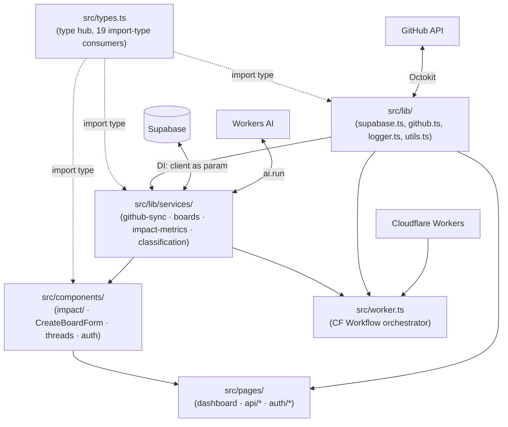

# Repo Map — Developer Onboarding

> Synthesised: 2026-07-28 | Sources: `artifact-1-territory.md` (git activity, 254 commits), `artifact-2-structure.md` (depcruiser, 110 modules / 346 deps), `artifact-3-contributors.md` (authorship analysis)

---

## 1. TL;DR

GitGud is an Astro 6 SSR app with React islands, deployed to Cloudflare Workers, backed by Supabase. Its core function is syncing GitHub PR data into a structured database and surfacing contribution metrics. The project is ~10 weeks old and built almost entirely by one person (Tomasz Sierpiński) with Claude as AI co-pilot. Work is concentrated in two places: the GitHub sync pipeline (`github-sync.ts` + `worker.ts`) and the business services layer (`src/lib/services/`). The schema is stabilising (Q2: 35 migrations → Q3: 9), but three invisible coupling channels are active and unenforceable by the static import graph. The most dangerous area for a new contributor is the Cloudflare Workers orchestration — constraint decisions accumulated over 30+ commits are not written down anywhere.



---

## 2. Territory

### Responsibility zones

| Zone | Key paths | Depth | Activity |
|---|---|---|---|
| **Sync pipeline** | `github-sync.ts`, `worker.ts` | Very deep | 67 changes — #1 hotspot pair |
| **Business services** | `src/lib/services/` | Deep | 55 dir-changes; 4 services |
| **Schema** | `supabase/migrations/` | Deep | 44 dir-changes; 44 migrations total |
| **Impact feature UI** | `src/components/impact/` | Medium | 30 dir-changes; 11 subcomponents |
| **Board creation wizard** | `CreateBoardForm.tsx`, `wizard-reducer.ts` | Medium | 8+7 changes; 769+424 lines |
| **API routes** | `src/pages/api/` | Medium | Active during features; quiet now |
| **Auth** | `src/components/auth/`, `src/pages/auth/` | Shallow | 12 dir-changes; settled in Q2 |
| **shadcn/ui primitives** | `src/components/ui/` | Shallow | 13 changes; additive only |

### Module depth (size × churn)

Large files that are also hot are the most expensive to change:

| File | Lines | Changes | Status |
|---|---|---|---|
| `src/lib/services/impact-metrics.ts` | 1150 | — | 6 independent exports in one file — mechanical split candidate |
| `src/components/CreateBoardForm.tsx` | 769 | 8 | Largest component, no internal decomposition |
| `src/lib/services/github-sync.ts` | 620 | **37** | Hotspot #1; `syncPrBatch` (211 lines) does fetch + map + persist |
| `src/worker.ts` | 521 | **30** | 6-phase class; small depth because logic lives in methods |
| `src/lib/services/classification.ts` | 432 | — | 10 functions, depth 4 — clean pipeline, not a concern |

### Activity over time

Q2 (May–Jun): bootstrap, 35 migrations, UI/backend built in parallel. Q3 (Jul): schema settling, worker refactoring, classification voting added. The project has entered stabilisation — new features are now additions, not rewrites of existing flows.

---

## 3. Real Couplings

### Git co-change (from artifact-1)

These pairs change together often enough that a PR touching one should consciously check the other:

| Pair | Co-commits | Why |
|---|---|---|
| `src/lib` + `src/pages` | 17 | SSR: pages call services directly (via `supabase.ts` — see import graph) |
| `src/lib` + `supabase/migrations` | 16 | Schema change forces service/type update; `types.ts` is the bridge |
| `src/components` + `src/pages` | 15 | Astro island pattern: component embedded in `.astro` |
| `src/pages` + `supabase/migrations` | 13 | Full-stack features land in one commit |

### Import graph structure (from artifact-2, depcruiser)

The static import graph is a clean DAG. Layer boundaries are enforced by `npm run lint:deps`. Dependency direction flows downward only:

```
types.ts  ←  lib/  ←  lib/services/  ←  components/  ←  pages/ / layouts/ / entry
```

High fan-in = high blast radius if changed:

| Module | Fan-in | Source |
|---|---|---|
| `src/lib/logger.ts` | 29 | import graph |
| `src/lib/supabase.ts` | 28 | import graph — explains `lib`+`pages` git coupling |
| `src/lib/utils.ts` | 19 | import graph — `cn()` imported by every shadcn component |
| `src/lib/services/boards.ts` | 14 | import graph |

### Three invisible coupling channels (not visible to depcruiser)

#### A. `import type` — TypeScript-only coupling (source: artifact-2 §5a)

`src/types.ts` has runtime fan-in = 0, but **19 files** import from it via `import type`. A type rename in `types.ts` cascades as `tsc` errors across 3 layers. `npm run lint:deps` stays green; only `tsc --noEmit` catches the blast. The only known tool that enforces this: `npm run test:typecheck`.

Note: `github-sync.ts` (hotspot #1) does **not** import from `types.ts` — its types are local or inferred from Supabase schema.

#### B. Dependency injection — Supabase client as parameter (source: artifact-2 §5b)

All four services receive the Supabase client as a first argument, not via import. This is correct DI and makes services testable in isolation. Side-effect: the static graph shows service fan-out = 1 (only `logger.ts`), which **severely understates** actual coupling. There are 4 copy-pasted `type SupabaseClient = NonNullable<ReturnType<typeof createClient>>` definitions. No tooling enforces consistency.

#### C. `fetch()` URL strings — runtime API coupling (source: artifact-2 §5c)

25 `fetch()` calls across 11 components reference API endpoints by hardcoded string. TypeScript does not verify these; depcruiser does not see them. **A route rename is invisible to all static tooling.** This already happened once: `boards/` → `board/` (PR #32). The components with the most exposure: `CreateBoardForm.tsx` (7 calls), `ContributorManager.tsx` (3), `RepoManager.tsx` (3).

### What the graph does NOT cover

Astro pages load React components via `client:*` directives in `.astro` files. Depcruiser resolves `.astro` → `.tsx` edges **partially** — most React component "orphans" in the graph are in fact used from `.astro` pages. The import graph should be read with this blind spot in mind: absence of an edge from an `.astro` file is `unknown`, not "no dependency."

---

## 4. Risk Zones

| Zone | One-liner |
|---|---|
| `github-sync.ts` + `worker.ts` | 30+ commits of accumulated CF Workers constraint decisions (subrequest budgets, GQL batching, adaptive backoff) — none written down; one full revert already happened (PR #68) |
| `src/types.ts` | 19 consumers via `import type`; `lint:deps` gives false green; only `tsc --noEmit` catches cascade breaks |
| `fetch()` URL coupling | 25 hardcoded strings in 11 components; a route rename breaks silently with no static warning |
| `src/lib/services/boards.ts` | Fan-in 14 (every board operation routes through here), zero dedicated tests; the test gap is deliberate due to Supabase mock complexity |
| `src/lib/services/impact-metrics.ts` | 1150 lines, 5 API endpoints all share the same `{boards, impact-metrics}` import pair; the split **must land in one atomic PR** or endpoints end up on mixed imports |
| `src/lib/github.ts` + `SyncIndicator.tsx` | Security-critical PAT handling built over multiple phases; `SyncIndicator.tsx` has zero tests; polling pattern needs `vi.useFakeTimers()` and has never been set up |

---

## 5. Who to Ask

This is a solo project. All commits originate from **Tomasz Sierpiński** (`sierpinski.tomasz@gmail.com`). There are no other human contributors.

| Zone | Contact | Mode |
|---|---|---|
| Worker/sync orchestration | Tomasz | **Schedule a knowledge-transfer session** — the constraint history is in commit messages, not in code or docs |
| PAT security / `github.ts` | Tomasz | **Explicit handoff** — encryption/decryption, retry strategy, non-leakage tests were built incrementally; the decisions aren't documented |
| `types.ts` type cascade | Tomasz | Code is readable; the risk is structural — just run `tsc --noEmit` before and after any type change |
| `boards.ts` (no tests) | Tomasz | Familiarity is high; test coverage is the blocker before safe independent changes |
| `fetch()` URL coupling | Tomasz | Low knowledge gap; a URL registry or tRPC-style client would fix it tooling-first |
| Impact feature / classification | Tomasz | Well-covered by tests; ask only for business logic intent |

---

## 6. First Day — What to Read

Read in this order. Each entry unlocks the next.

1. **`src/types.ts`** (278 lines) — every domain shape lives here; read before touching any service or component. Changes cascade to 19 files via `import type`.

2. **`src/middleware.ts`** — auth flow entry point; explains `context.locals.user` available on every request and which routes are protected.

3. **`src/lib/supabase.ts`** — SSR Supabase client, cookie-based sessions; fan-in 28. Understanding this explains the `src/lib` + `src/pages` git coupling (17 co-commits).

4. **`src/lib/github.ts`** (165 lines) — Octokit wrapper with PAT decryption, retry, and rate-limit handling. Security-critical. Read before touching any GitHub API path.

5. **`src/lib/services/github-sync.ts`** (620 lines, 37 changes) — hotspot #1. Focus on `syncPrBatch` (211 lines): it encodes the Cloudflare subrequest budget constraints. Do not modify without the context from the commit history (see §4).

6. **`src/worker.ts`** (521 lines, 30 changes) — Cloudflare Workflow orchestrator; 6-phase switch. Each phase is a class method. Read alongside `github-sync.ts`.

7. **`src/lib/services/boards.ts`** (189 lines) — board CRUD service; fan-in 14; every board operation routes through here. Zero dedicated tests — be careful with changes.

8. **`src/pages/dashboard.astro`** (52 lines) — main user-facing entry point; shows the Astro island pattern (React component embedded via `client:*`).

---

## 7. Limitations

**Time window:** 2026-05-21 to 2026-07-28 (~10 weeks). This is the full project lifetime, not a rolling year — the map covers everything, but the project is young and patterns may not be stable yet.

**What git activity measures:** frequency of change, not importance. A file unchanged for months may be load-bearing; a file with 37 changes may just be undergoing active rework.

**Depcruiser scope:** `src/` only (110 modules). The following are **outside the dependency graph entirely**:
- `supabase/migrations/` — SQL, not analysed by depcruiser
- `src/worker.ts` as a Cloudflare entry point — its runtime bindings (`env.AI`, `env.GITHUB_SYNC_WORKFLOW`) are invisible to static analysis
- Astro `.astro` → React `.tsx` edges — partially resolved; most component "orphans" are false positives
- `tests/` — excluded by configuration

**What this map does NOT tell you:**
- Runtime behaviour under Cloudflare Workers constraints (subrequest budgets, Workflow durability, secondary rate limits)
- Which Supabase RLS policies exist and why
- The intent behind specific classification thresholds or metric formulas
- Whether `src/lib/token-status.ts` is live code or dead (marked as possible dead code in structure map; verify before touching)
